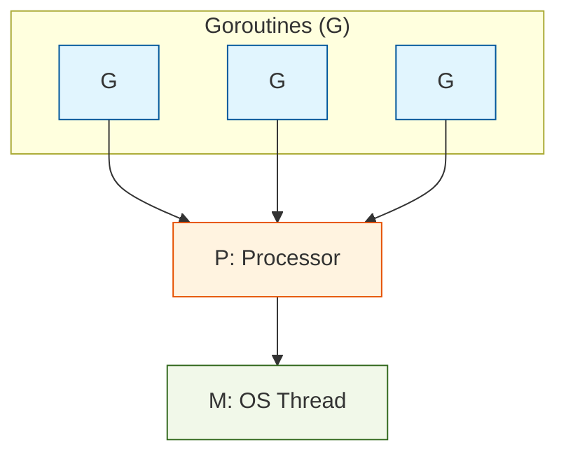

# Goroutine 基础

Goroutine 是 Go 语言并发编程的核心。它是由 Go 运行时管理的轻量级线程，使用起来非常简单。

## 2.1 go 关键字

启动一个 Goroutine 只需要在函数调用前加上 `go` 关键字：

```go
// goroutines/example1
package main

import (
    "fmt"
    "time"
)

func main() {
    go SayHello()

    fmt.Println("hello from main")
    time.Sleep(time.Second)
}

func SayHello() {
    fmt.Println("hello from goroutine")
}
```

**输出**（顺序可能不同）：
```
hello from main
hello from goroutine
```

**注意**：主 Goroutine（main 函数）退出时，程序会立即结束，不会等待其他 Goroutine 完成。这就是为什么我们需要 `time.Sleep` 来等待。

> ⚠️ 在生产代码中，不要使用 `time.Sleep` 来等待 Goroutine 完成。后面我们会学习更好的同步方式。

## 2.2 匿名函数与 Goroutine

Go 支持匿名函数，这在启动 Goroutine 时非常有用：

```go
// goroutines/example2
package main

import (
    "fmt"
    "time"
)

func main() {
    go func() {
        fmt.Println("hello from goroutine")
    }()

    fmt.Println("hello from main")
    time.Sleep(time.Second)
}
```

注意匿名函数后面的 `()`，这表示立即调用该函数。

## 2.3 函数作为一等公民

在 Go 中，函数是一等公民，可以赋值给变量：

```go
// goroutines/example3
package main

import (
    "fmt"
    "time"
)

func main() {
    sayHello := func() {
        fmt.Println("hello from goroutine")
    }

    go sayHello()

    fmt.Println("hello from main")
    time.Sleep(time.Second)
}
```

这种方式使代码更具可读性，特别是当函数逻辑复杂时。

## 2.4 向 Goroutine 传递参数

在启动 Goroutine 时传递参数：

```go
package main

import (
    "fmt"
    "time"
)

func main() {
    for i := 0; i < 5; i++ {
        go func(n int) {
            fmt.Println("goroutine:", n)
        }(i)  // 将 i 作为参数传递
    }
    
    time.Sleep(time.Second)
}
```

**输出**（顺序可能不同）：
```
goroutine: 0
goroutine: 4
goroutine: 1
goroutine: 2
goroutine: 3
```

## 2.5 Goroutine 的调度

Go 运行时使用 **M:N 调度器**，将 M 个 Goroutine 调度到 N 个 OS 线程上执行：

- **G**（Goroutine）：Go 协程
- **M**（Machine）：OS 线程
- **P**（Processor）：逻辑处理器，数量默认等于 CPU 核心数



可以通过 `runtime.GOMAXPROCS()` 设置 P 的数量：

```go
package main

import (
    "fmt"
    "runtime"
)

func main() {
    // 获取当前 GOMAXPROCS 的值
    fmt.Println("GOMAXPROCS:", runtime.GOMAXPROCS(0))
    
    // 设置为 4 个处理器
    runtime.GOMAXPROCS(4)
    fmt.Println("GOMAXPROCS:", runtime.GOMAXPROCS(0))
    
    // 设置为 CPU 核心数（这是默认行为）
    runtime.GOMAXPROCS(runtime.NumCPU())
}
```

## 2.6 Goroutine 的生命周期

Goroutine 在以下情况会结束：

1. **函数正常返回**
2. **发生不可恢复的 panic**
3. **被其他 Goroutine 通过某种机制通知退出**（如 Context、Channel）

```go
package main

import (
    "fmt"
    "time"
)

func main() {
    done := make(chan bool)
    
    go func() {
        fmt.Println("goroutine 开始工作")
        time.Sleep(2 * time.Second)
        fmt.Println("goroutine 完成工作")
        done <- true  // 通知主 goroutine
    }()
    
    <-done  // 等待 goroutine 完成
    fmt.Println("main 退出")
}
```

## 2.7 小结

- 使用 `go` 关键字启动 Goroutine
- Goroutine 非常轻量，可以创建大量实例
- 主 Goroutine 退出时程序立即结束
- 永远不要使用 `time.Sleep` 进行同步
- Go 运行时会自动调度 Goroutine

下一章，我们将学习闭包与 Goroutine 结合使用时的常见陷阱。
