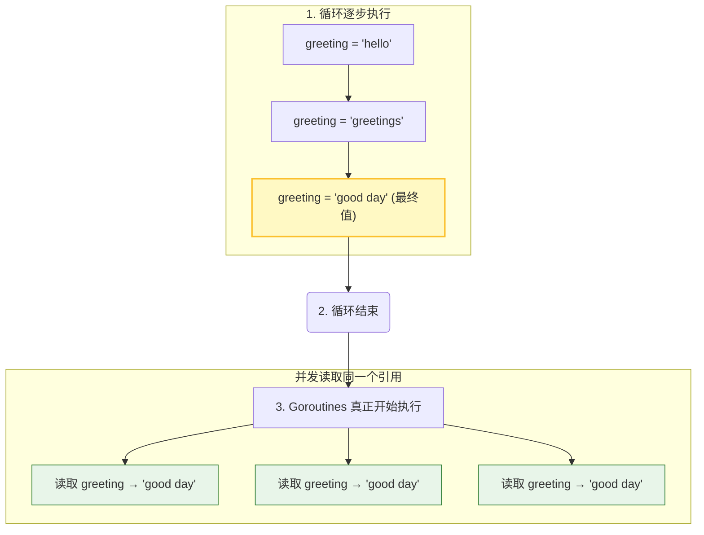

# 闭包与 Goroutine

闭包是 Go 中强大的特性，但在与 Goroutine 结合使用时，如果不小心很容易引入 bug。本章将深入探讨这个话题。

## 3.1 什么是闭包

闭包是一个函数，它可以引用其外部作用域中的变量。在 Go 中，匿名函数经常形成闭包：

```go
// goroutine-and-closure/simple-closure
package main

import (
    "fmt"
    "time"
)

func main() {
    greeting := "hello"

    go func() {
        greeting = "welcome"  // 修改外部变量
    }()

    time.Sleep(time.Millisecond)
    fmt.Println(greeting)  // 输出: welcome
}
```

闭包捕获的是变量的**引用**，而不是变量的**值**。

## 3.2 闭包实现斐波那契数列

闭包可以保持状态，这在某些场景下非常有用：

```go
// goroutine-and-closure/fibonacci
package main

import "fmt"

func main() {
    fibonacci := func() func() int {
        back1, back2 := -1, 1
        return func() int {
            back1, back2 = back2, (back1 + back2)
            return back2
        }
    }

    f := fibonacci()

    for i := 0; i < 10; i++ {
        fmt.Println(f())
    }
}
```

**输出**：
```
0
1
1
2
3
5
8
13
21
34
```

## 3.3 闭包与 Goroutine 的常见错误

这是 Go 并发编程中最常见的错误之一：

```go
// goroutine-and-closure/common-mistake
package main

import (
    "fmt"
    "time"
)

func main() {
    for _, greeting := range []string{"hello", "greetings", "good day"} {
        go func() {
            fmt.Println(greeting)  // ❌ 错误：捕获了循环变量
        }()
    }

    time.Sleep(1 * time.Second)
}
```

**可能的输出**：
```
good day
good day
good day
```

### 为什么会这样？

1. 闭包捕获的是变量 `greeting` 的**引用**，而不是值
2. 循环很快执行完毕，此时 `greeting` 的值为 `"good day"`
3. 当 Goroutine 开始执行时，它们都读取同一个变量，得到最终值

### 图解



## 3.4 正确的做法

### 方法 1：将变量作为参数传递

```go
// goroutine-and-closure/common-mistake-avoid
package main

import (
    "fmt"
    "time"
)

func main() {
    for _, greeting := range []string{"hello", "greetings", "good day"} {
        go func(words string) {  // 作为参数传入
            fmt.Println(words)
        }(greeting)  // 传递当前值
    }

    time.Sleep(1 * time.Second)
}
```

**输出**（顺序可能不同）：
```
hello
good day
greetings
```

### 方法 2：在循环内创建新变量

```go
package main

import (
    "fmt"
    "time"
)

func main() {
    for _, greeting := range []string{"hello", "greetings", "good day"} {
        greeting := greeting  // 创建新的局部变量（变量遮蔽）
        go func() {
            fmt.Println(greeting)
        }()
    }

    time.Sleep(1 * time.Second)
}
```

> 💡 从 Go 1.22 开始，for 循环的语义有所变化，每次迭代都会创建新的变量，但为了代码的可读性和向后兼容性，建议仍然显式处理。

## 3.5 检测闭包问题

Go 提供了竞态检测器来发现这类问题：

```bash
go run -race main.go
```

如果存在数据竞争，会输出类似：

```
WARNING: DATA RACE
Read at 0x00c00001c060 by goroutine 7:
  main.main.func1()
      /path/to/main.go:12 +0x30

Previous write at 0x00c00001c060 by main goroutine:
  main.main()
      /path/to/main.go:10 +0x98
```

## 3.6 实际案例：健康检查

让我们看一个实际的例子 - 并发检查多个网站的可用性：

```go
package main

import (
    "fmt"
    "net/http"
    "time"
)

func main() {
    links := []string{
        "http://baidu.com",
        "http://qq.com",
        "http://taobao.com",
    }

    for _, link := range links {
        go checkLink(link)  // ✅ 这里没问题，传递的是值
    }

    time.Sleep(5 * time.Second)
}

func checkLink(link string) {
    _, err := http.Get(link)
    if err != nil {
        fmt.Println(link, "might be down!")
        return
    }
    fmt.Println(link, "is up!")
}
```

## 3.7 小结

- 闭包捕获变量的**引用**，不是值
- 在循环中启动 Goroutine 时，要特别注意循环变量
- 解决方案：将变量作为参数传递，或创建局部副本
- 使用 `go run -race` 检测数据竞争
- Go 1.22+ 改进了循环变量的语义，但仍建议显式处理

下一章，我们将学习如何使用同步原语来解决竞态条件。
