# 竞态条件与同步

当多个 Goroutine 并发访问共享数据时，如果不进行同步，就会产生**竞态条件**（Race Condition）。本章将介绍如何识别和解决这个问题。

## 4.1 什么是竞态条件

看下面这个程序，运行会有几种结果？

```go
// race-condition/simplest-race-condition
package main

import "fmt"

func main() {
    var data int

    go func() {
        data++
    }()

    if data == 0 {
        fmt.Printf("the value is %v.\n", data)
    }
}
```

**可能的结果**：

1. **什么也不打印**：`data++` 先于 `if` 语句执行，条件不成立
2. **打印 "the value is 0."**：`if` 和 `fmt.Printf` 在 `data++` 之前执行
3. **打印 "the value is 1."**：`if` 先执行（条件成立），但 `fmt.Printf` 在 `data++` 之后执行

这就是竞态条件：程序的行为取决于操作的执行顺序，而这个顺序是不确定的。

## 4.2 使用竞态检测器

Go 提供了内置的竞态检测器：

```bash
go run -race main.go
```

输出示例：
```
==================
WARNING: DATA RACE
Write at 0x00c00001c090 by goroutine 6:
  main.main.func1()
      /path/to/main.go:11 +0x3c

Read at 0x00c00001c090 by main goroutine:
  main.main()
      /path/to/main.go:14 +0x88
==================
```

> 💡 在开发和测试阶段，始终使用 `-race` 标志运行程序。

## 4.3 互斥锁 sync.Mutex

互斥锁是解决竞态条件的经典方法：

```go
// mutex/mutex
package main

import (
    "fmt"
    "sync"
)

func main() {
    var lock sync.Mutex
    var data int

    go func() {
        lock.Lock()
        data++
        lock.Unlock()
    }()

    lock.Lock()
    fmt.Printf("the value is %v.\n", data)
    lock.Unlock()
}
```

### Mutex 的基本规则

1. 调用 `Lock()` 获取锁
2. 调用 `Unlock()` 释放锁
3. 如果锁被占用，`Lock()` 会阻塞等待
4. **同一个 Goroutine 中，不要重复 Lock**（会导致死锁）

### 使用 defer 释放锁

推荐使用 `defer` 确保锁被释放：

```go
func doSomething() {
    mu.Lock()
    defer mu.Unlock()
    
    // 即使发生 panic，锁也会被释放
    // ... 操作共享数据 ...
}
```

## 4.4 读写锁 sync.RWMutex

当读操作远多于写操作时，使用读写锁可以提高性能：

```go
package main

import (
    "fmt"
    "sync"
    "time"
)

type Counter struct {
    mu    sync.RWMutex
    value int
}

func (c *Counter) Read() int {
    c.mu.RLock()
    defer c.mu.RUnlock()
    return c.value
}

func (c *Counter) Increment() {
    c.mu.Lock()
    defer c.mu.Unlock()
    c.value++
}

func main() {
    counter := &Counter{}
    
    // 多个 goroutine 并发读写
    for i := 0; i < 10; i++ {
        go func() {
            for j := 0; j < 100; j++ {
                counter.Increment()
            }
        }()
    }
    
    for i := 0; i < 10; i++ {
        go func() {
            for j := 0; j < 100; j++ {
                _ = counter.Read()
            }
        }()
    }
    
    time.Sleep(time.Second)
    fmt.Println("Final value:", counter.Read())
}
```

### RWMutex 的规则

- `RLock()`：获取读锁，多个读锁可以共存
- `RUnlock()`：释放读锁
- `Lock()`：获取写锁，独占访问
- `Unlock()`：释放写锁

```mermaid
gantt
    title RWMutex 读写锁定示例
    dateFormat  X
    axisFormat %s
    
    section 读锁 (Shared)
    Read 1 (R1) :a1, 0, 10
    Read 2 (R2) :a2, 2, 8
    Read 3 (R3) :a3, 4, 12
    
    section 写锁 (Exclusive)
    Wait for Write :crit, 12, 14
    Write 1 (W1)  :active, 14, 20
```



## 4.5 原子操作 sync/atomic

对于简单的数值操作，可以使用原子操作：

```go
package main

import (
    "fmt"
    "sync"
    "sync/atomic"
)

func main() {
    var counter int64
    var wg sync.WaitGroup
    
    for i := 0; i < 1000; i++ {
        wg.Add(1)
        go func() {
            defer wg.Done()
            atomic.AddInt64(&counter, 1)
        }()
    }
    
    wg.Wait()
    fmt.Println("Counter:", counter)  // 一定是 1000
}
```

常用的原子操作：
- `atomic.AddInt64()` / `atomic.AddInt32()`
- `atomic.LoadInt64()` / `atomic.StoreInt64()`
- `atomic.CompareAndSwapInt64()`

## 4.6 条件变量 sync.Cond

当需要等待某个条件满足时，可以使用条件变量：

```go
// cond/main.go
package main

import (
    "fmt"
    "sync"
    "time"
)

func main() {
    var mu sync.Mutex
    cond := sync.NewCond(&mu)
    ready := false
    
    // 消费者
    go func() {
        mu.Lock()
        for !ready {
            cond.Wait()  // 等待条件满足
        }
        fmt.Println("条件满足，开始处理")
        mu.Unlock()
    }()
    
    // 生产者
    time.Sleep(time.Second)
    mu.Lock()
    ready = true
    cond.Signal()  // 通知一个等待的 goroutine
    mu.Unlock()
    
    time.Sleep(time.Second)
}
```

### Cond 的方法

- `Wait()`：释放锁并等待通知，被唤醒后重新获取锁
- `Signal()`：唤醒一个等待的 Goroutine
- `Broadcast()`：唤醒所有等待的 Goroutine

> 💡 `Wait()` 应该总是在循环中调用，因为被唤醒不代表条件一定满足。

## 4.7 sync.Once

确保某个操作只执行一次：

```go
package main

import (
    "fmt"
    "sync"
)

var once sync.Once
var config map[string]string

func loadConfig() {
    fmt.Println("Loading config...")
    config = map[string]string{
        "host": "localhost",
        "port": "8080",
    }
}

func getConfig() map[string]string {
    once.Do(loadConfig)  // 只会执行一次
    return config
}

func main() {
    var wg sync.WaitGroup
    for i := 0; i < 10; i++ {
        wg.Add(1)
        go func() {
            defer wg.Done()
            cfg := getConfig()
            fmt.Println(cfg["host"])
        }()
    }
    wg.Wait()
}
```

输出：
```
Loading config...
localhost
localhost
... (共 10 个 localhost)
```

## 4.8 小结

| 原语 | 用途 | 适用场景 |
|------|------|----------|
| `sync.Mutex` | 互斥访问 | 保护共享资源 |
| `sync.RWMutex` | 读写分离 | 读多写少场景 |
| `sync/atomic` | 原子操作 | 简单的数值操作 |
| `sync.Cond` | 条件等待 | 生产者-消费者模式 |
| `sync.Once` | 只执行一次 | 初始化操作 |

**选择建议**：
- 优先考虑使用 Channel 进行同步
- 如果必须共享内存，使用 Mutex
- 简单计数器可以使用 atomic
- 不要过度使用锁，可能导致性能问题

下一章，我们将学习 WaitGroup 进行 Goroutine 同步。
