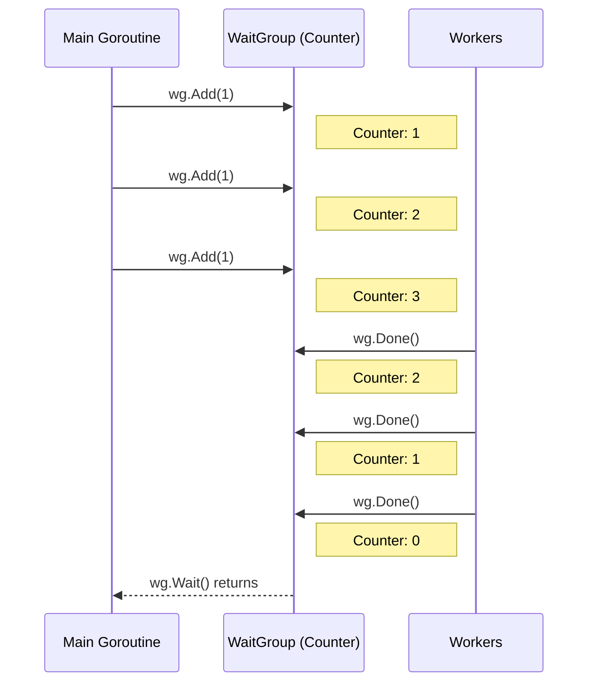

# WaitGroup 同步

`sync.WaitGroup` 是 Go 中最常用的同步原语之一，用于等待一组 Goroutine 完成任务。

## 5.1 WaitGroup 基础

```go
// wait-group/helloworld-waitgroup
package main

import (
    "fmt"
    "sync"
)

func main() {
    var wg sync.WaitGroup

    for i := 0; i < 10; i++ {
        wg.Add(1)
        go func(i int) {
            defer wg.Done()
            fmt.Println(i)
        }(i)
    }
    
    wg.Wait()
    fmt.Println("All goroutines complete.")
}
```

**输出**（顺序可能不同）：
```
0
9
1
5
6
7
8
2
3
4
All goroutines complete.
```

## 5.2 WaitGroup 的三个方法

| 方法 | 说明 |
|------|------|
| `Add(delta int)` | 增加计数器，通常在启动 Goroutine 前调用 |
| `Done()` | 减少计数器（等同于 `Add(-1)`） |
| `Wait()` | 阻塞直到计数器归零 |

### 工作流程



## 5.3 常见模式

### 模式 1：在循环外 Add，循环内启动

```go
// wait-group/waitgroup-common-pattern
package main

import (
    "fmt"
    "sync"
)

func main() {
    var wg sync.WaitGroup
    
    tasks := []string{"task1", "task2", "task3"}
    
    wg.Add(len(tasks))  // 一次性添加所有任务计数
    
    for _, task := range tasks {
        go func(t string) {
            defer wg.Done()
            fmt.Println("Processing:", t)
        }(task)
    }
    
    wg.Wait()
    fmt.Println("All tasks completed")
}
```

### 模式 2：在循环内 Add

```go
func main() {
    var wg sync.WaitGroup
    
    for i := 0; i < 5; i++ {
        wg.Add(1)  // 每次循环增加计数
        go func(n int) {
            defer wg.Done()
            fmt.Println("Worker:", n)
        }(i)
    }
    
    wg.Wait()
}
```

> 💡 `wg.Add(1)` 必须在 `go func()` 之前调用，否则可能出现竞态条件。

## 5.4 实际案例：并发健康检查

```go
package main

import (
    "fmt"
    "net/http"
    "sync"
)

func main() {
    var wg sync.WaitGroup

    links := []string{
        "http://baidu.com",
        "http://qq.com",
        "http://taobao.com",
        "http://jd.com",
    }

    for _, link := range links {
        wg.Add(1)
        go checkLink(&wg, link)
    }

    wg.Wait()
    fmt.Println("All checks completed")
}

func checkLink(wg *sync.WaitGroup, link string) {
    defer wg.Done()
    
    resp, err := http.Get(link)
    if err != nil {
        fmt.Printf("%s might be down: %v\n", link, err)
        return
    }
    defer resp.Body.Close() // 关键：释放资源
    
    fmt.Printf("%s is up!\n", link)
}
```

## 5.5 常见错误

### 错误 1：传值导致复制

```go
// ❌ 错误：WaitGroup 被复制
func worker(wg sync.WaitGroup) {  // 值传递！
    defer wg.Done()  // 操作的是副本
    // ...
}

// ✅ 正确：传递指针
func worker(wg *sync.WaitGroup) {
    defer wg.Done()
    // ...
}
```

### 错误 2：Add 在 Go 语句之后

```go
// ❌ 可能出错：Add 可能在 Done 之后执行
go func() {
    defer wg.Done()
    // ...
}()
wg.Add(1)  // 太晚了！

// ✅ 正确：Add 在 go 之前
wg.Add(1)
go func() {
    defer wg.Done()
    // ...
}()
```

### 错误 3：忘记 Done

```go
// ❌ 错误：忘记调用 Done
go func() {
    // wg.Done() 忘记了！
    doWork()
}()
wg.Wait()  // 永远阻塞

// ✅ 正确：使用 defer 确保调用
go func() {
    defer wg.Done()  // 即使 panic 也会执行
    doWork()
}()
```

## 5.6 与 errgroup 配合

标准库的 `WaitGroup` 不能传递错误。如果需要收集错误，可以使用 `golang.org/x/sync/errgroup`：

```go
package main

import (
    "fmt"
    "net/http"
    
    "golang.org/x/sync/errgroup"
)

func main() {
    var g errgroup.Group
    
    urls := []string{
        "http://baidu.com",
        "http://invalid.url.test",  // 这会失败
        "http://qq.com",
    }
    
    for _, url := range urls {
        url := url  // 闭包捕获
        g.Go(func() error {
            resp, err := http.Get(url)
            if err != nil {
                return err
            }
            resp.Body.Close()
            fmt.Println(url, "OK")
            return nil
        })
    }
    
    if err := g.Wait(); err != nil {
        fmt.Println("Error:", err)
    }
}
```

## 5.7 小结

- `WaitGroup` 用于等待一组 Goroutine 完成
- `Add()` 必须在 `go` 语句之前调用
- 使用 `defer wg.Done()` 确保计数器减少
- 传递 `WaitGroup` 时必须使用指针
- 需要错误处理时考虑使用 `errgroup`

下一章，我们将学习 Go 并发的核心—— Channel。
