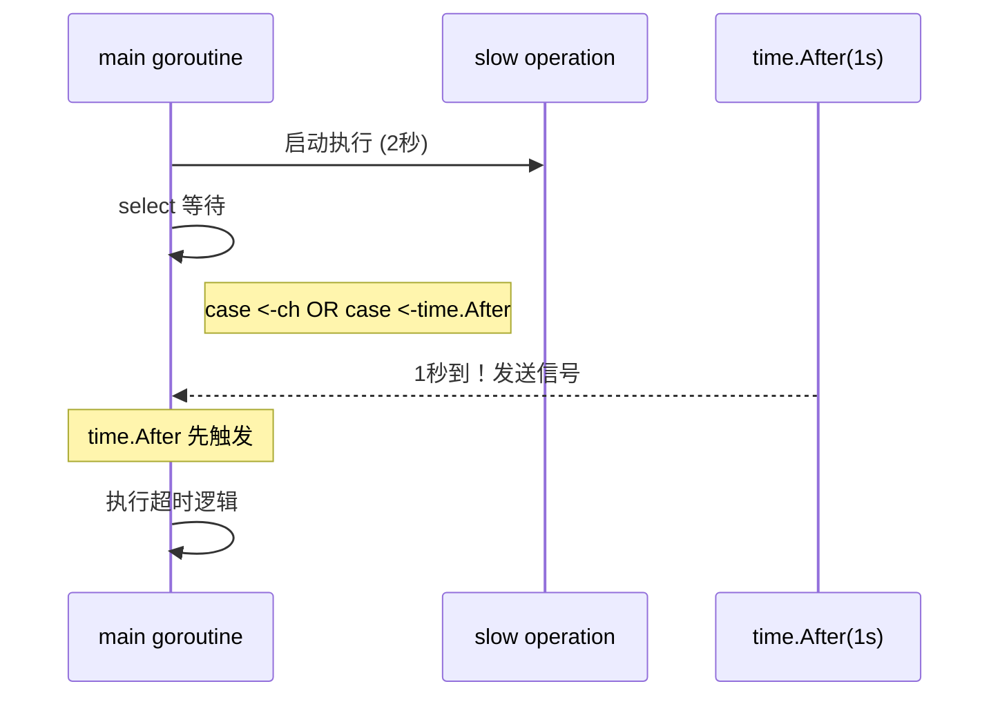

# Select 语句

`select` 语句让一个 Goroutine 可以同时等待多个 Channel 操作，是 Go 并发编程中的多路复用器。

## 7.1 基本语法

```go
select {
case <-ch1:
    // ch1 收到数据
case ch2 <- value:
    // 成功发送到 ch2
case value := <-ch3:
    // 从 ch3 收到 value
default:
    // 所有 channel 都没准备好
}
```

## 7.2 退出信号

使用 select 和 Channel 实现优雅退出：

```go
// channels/select
package main

import (
    "fmt"
    "time"
)

func main() {
    stop := make(chan bool)

    go func() {
        for {
            select {
            case <-stop:
                fmt.Println("收到停止信号，退出...")
                return
            default:
                fmt.Println("goroutine 监控中...")
                time.Sleep(2 * time.Second)
            }
        }
    }()

    time.Sleep(10 * time.Second)
    fmt.Println("通知监控停止")
    stop <- true
    
    time.Sleep(3 * time.Second)
}
```

## 7.3 超时处理

使用 `time.After` 实现超时：

```go
// channels/select-timeout
package main

import (
    "fmt"
    "time"
)

func main() {
    ch := make(chan string, 1)

    go func() {
        time.Sleep(2 * time.Second)  // 模拟耗时操作
        ch <- "result"
    }()

    select {
    case result := <-ch:
        fmt.Println("收到结果:", result)
    case <-time.After(1 * time.Second):
        fmt.Println("超时！")
    }
}
```

**输出**：
```
超时！
```

### 超时模式详解



## 7.4 非阻塞操作

使用 `default` 分支实现非阻塞：

```go
package main

import "fmt"

func main() {
    ch := make(chan int, 1)
    
    // 非阻塞发送
    select {
    case ch <- 1:
        fmt.Println("发送成功")
    default:
        fmt.Println("channel 已满，跳过")
    }
    
    // 非阻塞接收
    select {
    case value := <-ch:
        fmt.Println("收到:", value)
    default:
        fmt.Println("没有数据")
    }
}
```

## 7.5 多 Channel 选择

select 可以同时监听多个 channel：

```go
package main

import (
    "fmt"
    "time"
)

func main() {
    ch1 := make(chan string)
    ch2 := make(chan string)
    
    go func() {
        time.Sleep(1 * time.Second)
        ch1 <- "来自 channel 1"
    }()
    
    go func() {
        time.Sleep(2 * time.Second)
        ch2 <- "来自 channel 2"
    }()
    
    // 接收两个结果
    for i := 0; i < 2; i++ {
        select {
        case msg1 := <-ch1:
            fmt.Println(msg1)
        case msg2 := <-ch2:
            fmt.Println(msg2)
        }
    }
}
```

## 7.6 随机选择

当多个 case 同时就绪时，select 会**随机**选择一个执行：

```go
package main

import "fmt"

func main() {
    ch1 := make(chan int, 1)
    ch2 := make(chan int, 1)
    
    ch1 <- 1
    ch2 <- 2
    
    // 两个 case 都就绪，随机选择
    select {
    case <-ch1:
        fmt.Println("选择了 ch1")
    case <-ch2:
        fmt.Println("选择了 ch2")
    }
}
```

## 7.7 过载保护

使用 select + default 实现过载保护：

```go
// channels/selectjobqueue
package main

import (
    "fmt"
    "sync"
)

type Job struct {
    Name string
}

var wg sync.WaitGroup

func worker(id int, jobs <-chan Job) {
    defer wg.Done()
    for job := range jobs {
        fmt.Printf("worker %d: %s processed\n", id, job.Name)
    }
}

// 尝试入队，如果队列满则返回 false
func TryEnqueue(job Job, jobs chan<- Job) bool {
    select {
    case jobs <- job:
        return true
    default:
        return false  // 队列已满，拒绝
    }
}

func main() {
    jobs := make(chan Job, 10)  // 容量 10

    // 启动 3 个 worker
    for i := 0; i < 3; i++ {
        wg.Add(1)
        go worker(i, jobs)
    }

    // 尝试添加任务
    for i := 0; i < 20; i++ {
        job := Job{Name: fmt.Sprintf("job-%d", i)}
        if !TryEnqueue(job, jobs) {
            fmt.Printf("任务 %s 被拒绝：队列已满\n", job.Name)
        }
    }
    
    close(jobs)
    wg.Wait()
}
```

## 7.8 永久阻塞

空的 select 会永久阻塞：

```go
select {}  // 永远阻塞
```

这在某些场景下有用，比如阻止 main 函数退出：

```go
func main() {
    go server()
    select {}  // 永久运行
}
```

## 7.9 小结

| 模式 | 用途 |
|------|------|
| `select` + `case <-done` | 优雅退出 |
| `select` + `time.After` | 超时控制 |
| `select` + `default` | 非阻塞操作 |
| 多个 `case` | 多路复用 |
| 空 `select{}` | 永久阻塞 |

**关键点**：
- select 是 Go 并发的多路复用器
- 多个 case 就绪时随机选择
- default 使操作变为非阻塞
- 配合 time.After 实现超时

下一章，我们将学习 Context 进行更复杂的并发控制。
