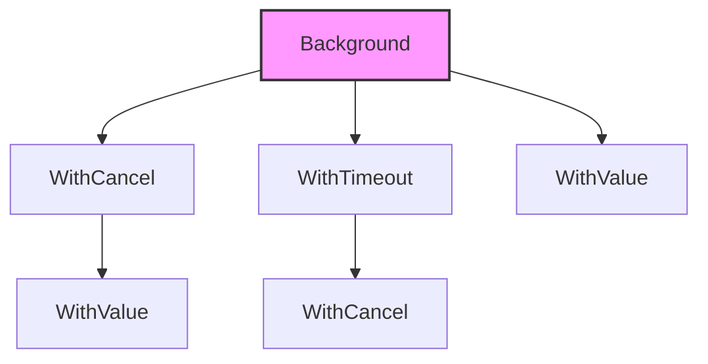

# Context 上下文

`context` 包是 Go 1.7 引入的并发控制机制，用于在 Goroutine 之间传递取消信号、截止时间和请求范围的值。

## 8.1 为什么需要 Context

考虑一个 HTTP 服务器处理请求的场景：

1. 客户端发起请求
2. 服务器启动多个 Goroutine 处理（查数据库、调用其他服务）
3. 客户端取消请求

如果没有 Context，我们很难优雅地取消所有相关的 Goroutine。

## 8.2 Context 类型

```go
type Context interface {
    Deadline() (deadline time.Time, ok bool)  // 截止时间
    Done() <-chan struct{}                    // 取消信号
    Err() error                               // 取消原因
    Value(key interface{}) interface{}        // 获取值
}
```

## 8.3 创建 Context

### 根 Context

```go
ctx := context.Background()  // 通常用于 main、init 或测试
ctx := context.TODO()        // 不确定使用哪个 context 时的占位符
```

### 可取消的 Context

```go
ctx, cancel := context.WithCancel(parentCtx)
defer cancel()  // 确保释放资源
```

### 带超时的 Context

```go
ctx, cancel := context.WithTimeout(parentCtx, 5*time.Second)
defer cancel()

ctx, cancel := context.WithDeadline(parentCtx, time.Now().Add(5*time.Second))
defer cancel()
```

### 带值的 Context

```go
ctx := context.WithValue(parentCtx, "key", "value")
```

## 8.4 基本示例

```go
// channels/context
package main

import (
    "context"
    "fmt"
    "time"
)

func main() {
    ctx, cancel := context.WithCancel(context.Background())

    go func(ctx context.Context) {
        for {
            select {
            case <-ctx.Done():
                fmt.Println("收到取消信号:", ctx.Err())
                return
            default:
                fmt.Println("工作中...")
                time.Sleep(1 * time.Second)
            }
        }
    }(ctx)

    time.Sleep(5 * time.Second)
    cancel()  // 发送取消信号
    
    time.Sleep(1 * time.Second)
}
```

**输出**：
```
工作中...
工作中...
工作中...
工作中...
工作中...
收到取消信号: context canceled
```

## 8.5 超时控制

```go
package main

import (
    "context"
    "fmt"
    "time"
)

func slowOperation(ctx context.Context) error {
    select {
    case <-time.After(3 * time.Second):
        return nil  // 操作完成
    case <-ctx.Done():
        return ctx.Err()  // 被取消或超时
    }
}

func main() {
    ctx, cancel := context.WithTimeout(context.Background(), 2*time.Second)
    defer cancel()

    if err := slowOperation(ctx); err != nil {
        fmt.Println("操作失败:", err)
    } else {
        fmt.Println("操作成功")
    }
}
```

**输出**：
```
操作失败: context deadline exceeded
```

## 8.6 传递请求范围的值

```go
// channels/contextwithvalue
package main

import (
    "context"
    "fmt"
)

type key string

const (
    userIDKey key = "userID"
    traceIDKey key = "traceID"
)

func main() {
    ctx := context.Background()
    
    // 添加值
    ctx = context.WithValue(ctx, userIDKey, "user-123")
    ctx = context.WithValue(ctx, traceIDKey, "trace-456")
    
    processRequest(ctx)
}

func processRequest(ctx context.Context) {
    userID := ctx.Value(userIDKey)
    traceID := ctx.Value(traceIDKey)
    
    fmt.Printf("Processing request for user: %v, trace: %v\n", userID, traceID)
}
```

> ⚠️ Context 值应该用于请求范围的数据，不要用于传递可选参数。

## 8.7 多 Goroutine 的 Context

```go
// channels/mutigoroutincontext
package main

import (
    "context"
    "fmt"
    "sync"
    "time"
)

func main() {
    ctx, cancel := context.WithCancel(context.Background())
    var wg sync.WaitGroup

    // 启动多个 worker
    for i := 0; i < 3; i++ {
        wg.Add(1)
        go worker(ctx, i, &wg)
    }

    time.Sleep(3 * time.Second)
    fmt.Println("取消所有 worker...")
    cancel()

    wg.Wait()
    fmt.Println("所有 worker 已退出")
}

func worker(ctx context.Context, id int, wg *sync.WaitGroup) {
    defer wg.Done()
    
    for {
        select {
        case <-ctx.Done():
            fmt.Printf("worker %d: 收到取消信号\n", id)
            return
        default:
            fmt.Printf("worker %d: 工作中\n", id)
            time.Sleep(1 * time.Second)
        }
    }
}
```

## 8.8 Context 的传播

Context 应该显式传递，通常作为函数的第一个参数：

```go
// ✅ 正确做法
func DoSomething(ctx context.Context, arg Arg) error {
    // ...
}

// ❌ 错误做法：不要存储在 struct 中（除非文档明确说明）
type MyStruct struct {
    ctx context.Context  // 不推荐
}
```

### Context 树



取消父 Context 会取消所有子 Context。

## 8.9 最佳实践

1. **传递而不是存储**：Context 应该作为参数传递，不要存储在 struct 中
2. **第一个参数**：Context 通常是函数的第一个参数，命名为 `ctx`
3. **总是 defer cancel()**：避免资源泄漏
4. **不要传递 nil**：使用 `context.TODO()` 代替
5. **不要用 Context 传递可选参数**：只传递请求范围的值

```go
// ✅ 推荐
func Process(ctx context.Context, userID string) error

// ❌ 不推荐
func Process(ctx context.Context) error {
    userID := ctx.Value("userID")  // 不要这样传参数
}
```

## 8.10 小结

| 函数 | 用途 |
|------|------|
| `context.Background()` | 根 context |
| `context.WithCancel()` | 可取消的 context |
| `context.WithTimeout()` | 带超时的 context |
| `context.WithDeadline()` | 带截止时间的 context |
| `context.WithValue()` | 带值的 context |

**关键点**：
- Context 用于传递取消信号和截止时间
- 取消父 Context 会自动取消所有子 Context
- 在 select 中监听 `ctx.Done()` 响应取消
- 总是 `defer cancel()` 释放资源

下一章，我们将学习常见的并发模式。
